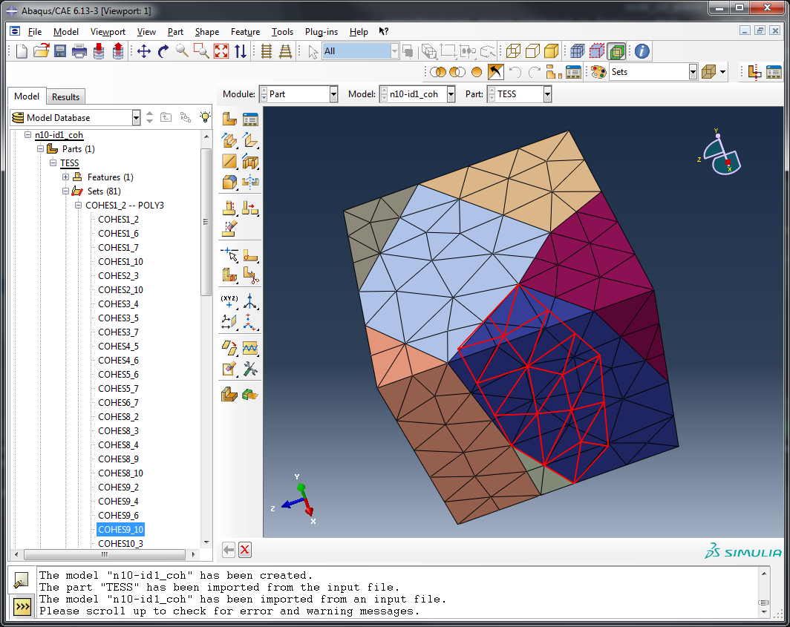
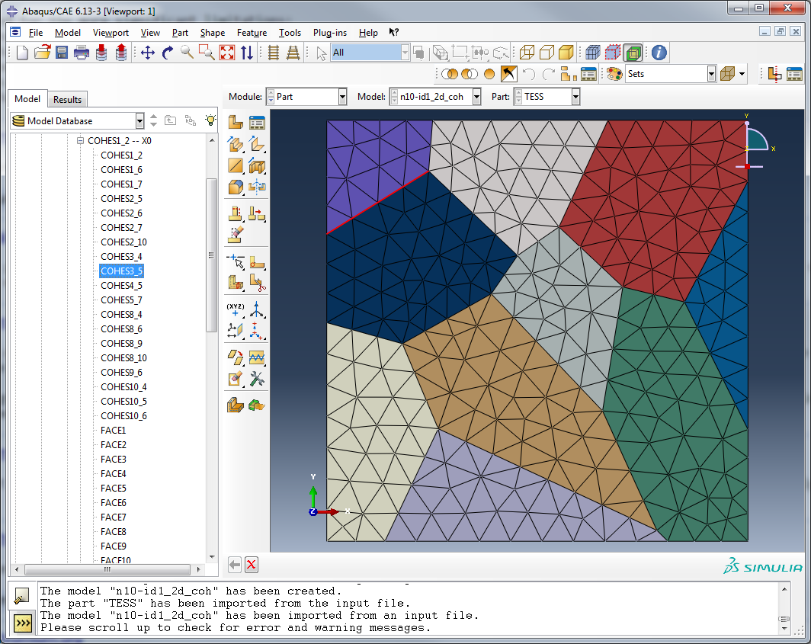

Insert interface elements
-------------------------

Interface elements are elements modelling an interface law between for example
grains in a model of a polycrystalline material. Phon has support for inserting
these elements into both a 2D mesh and 3D mesh. This is done with the function
:func:`phon.mesh_tools.create_cohesive_elements.create_cohesive_elements()`.

The function creates the interface element and also generates one element set for each grain boundary.
These element sets have the name ``cohesX_Y`` where X and Y are the grain ids to the two grains that share the grain
boundary.

The function requires some element sets with specific names to exist.
    * In a mesh each grain should have its own element set with the bulk elements.
      These should for a 3D mesh be called *POLYx* and for a 2D mesh be called *FACEx*
      where *x* is the grain id.
    * Each grain boundary should have its own element with the elements in the grain boundary.
      These elements will have a dimension one lower than the one of the bulk elements. The
      name for these sets should for a 3D mesh be called *FACEx* and for a 2D mesh be called
      *EDGEx*.

These names have been chosen so that a mesh files generated with Neper can directly be used. Note that you might need
the ``-dim all`` flag set on the mesher in Neper for all the elements and element sets to be exported correctly.
If you want to insert interface elements in a mesh generated with some other
software you need to make sure the output matches the above.

An example of a 3D mesh being read, cohesive elements inserted into it and then getting exported
is shown below.::

    >>> from phon.io_tools.read.read_from_abaqus_inp import read_from_abaqus_inp
    >>> from phon.mesh_tools.create_cohesive_elements import create_cohesive_elements
    >>> from phon.io_tools.write.export_to_abaqus import export_to_abaqus
    >>> mesh = read_from_abaqus_inp("n10-id1.inp")
    >>> create_cohesive_elements(mesh, mesh_dimension=3)
    >>> export_to_abaqus("cohesive_file.inp", mesh, write_2d_elements=False)

Opening the generated file in Abaqus shows the generated mesh. An element sets with the cohesive elements is highlighted.

For completeness sake, an image of cohesive elements in 2D is shown below:

